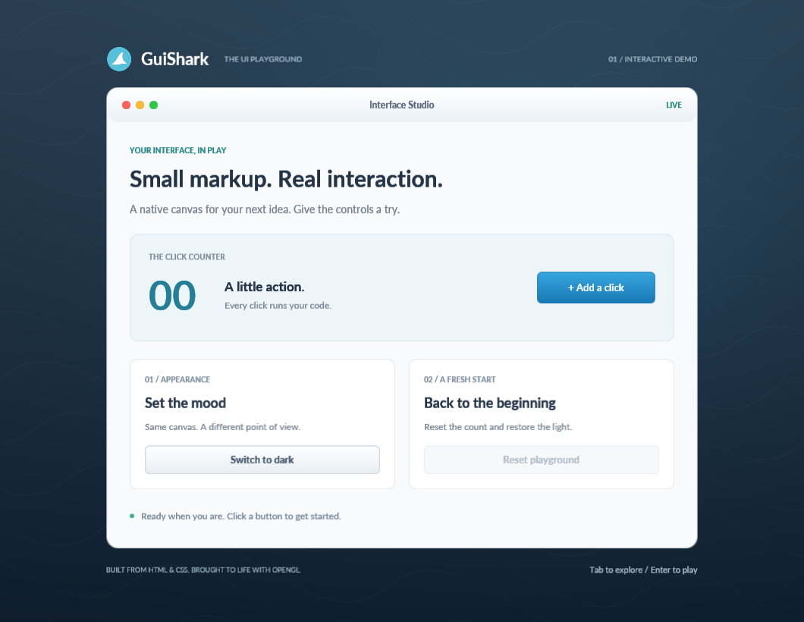
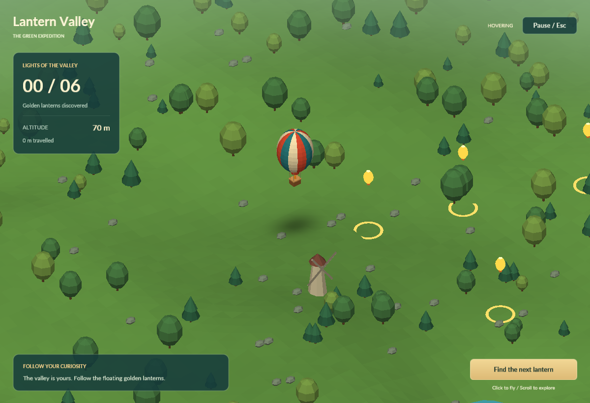
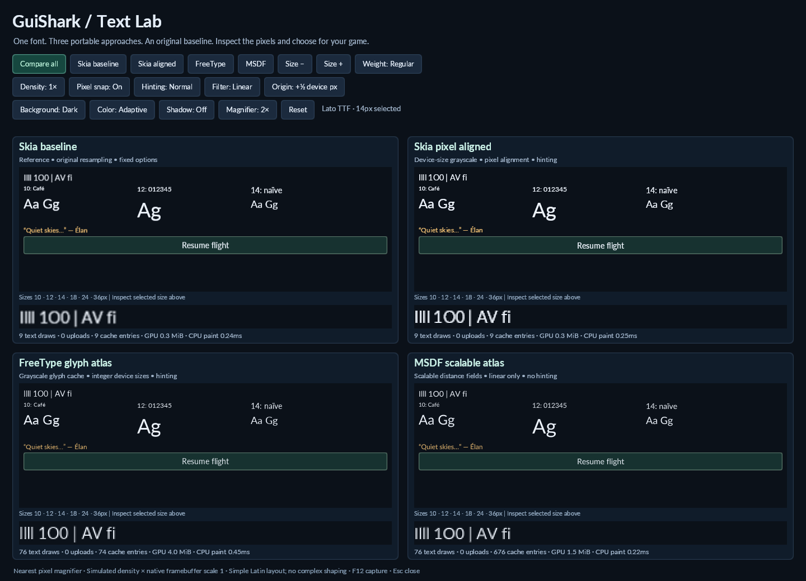
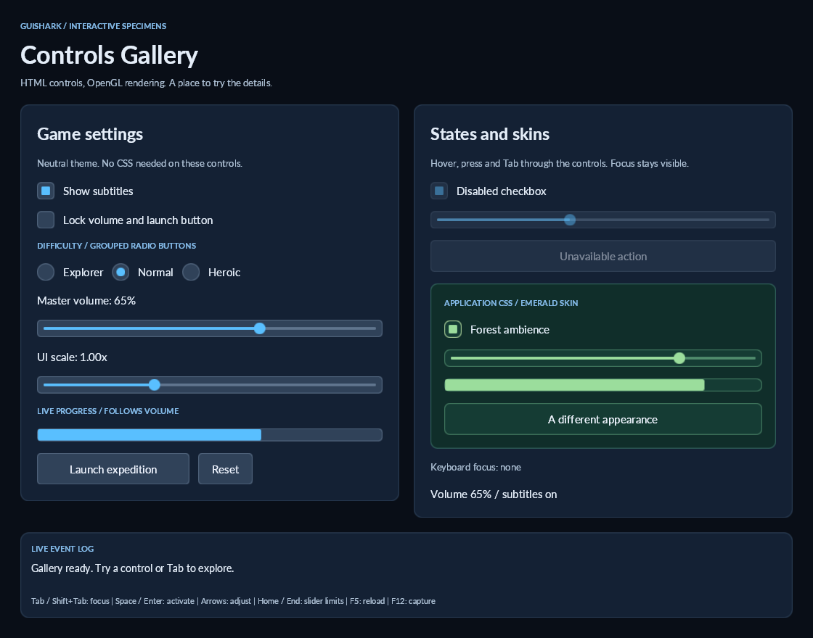

# GuiShark

Define a small interface in HTML and CSS, render it in an existing OpenGL application, and bind buttons to C# code.

The SDK is in `src/GuiShark` and `src/GuiShark.OpenGL`; all examples live in `src/demos`. It uses **.NET 10**, **AngleSharp 1.8.2**, **OpenTK 4.9.4**, **SkiaSharp 4.153.0**, and **SkiaSharp.HarfBuzz 4.153.0**. Shapes, borders, rounded corners, and gradients are drawn by OpenGL shaders. The Skia text backend draws shaped label bitmaps; the engine does not render the whole UI to a bitmap. There is no embedded browser or JavaScript runtime.



## Run the playground

Install a stable .NET 10 SDK and use a desktop with an OpenGL 3.3 core driver.

```powershell
dotnet build Gui.Shark.sln
dotnet run --project src/demos/GuiShark.Demo -- src/demos/GuiShark.Demo/Assets
```

Run from the repository root. Passing the source asset directory lets **F5** reload HTML/CSS edits. Without the argument, the demo uses assets copied beside the executable. The window is resizable, with a minimum size to keep this example readable.

- **Add a click** increments the counter using a C# event handler.
- **Switch to dark/light** changes a CSS class and the independent host scene.
- **Reset playground** restores the defaults; it is disabled until something changes.
- **Tab / Shift+Tab** navigate enabled buttons; **Enter / Space** activate them.
- **Escape** clears UI focus/capture; press again to close.
- **F5** reloads the document and resets demo state. Invalid CSS is reported in the console and leaves the existing UI running.
- **F12** saves a PNG of the actual framebuffer in `artifacts/` under the current working directory.

Edit [the HTML](src/demos/GuiShark.Demo/Assets/index.html), [the CSS](src/demos/GuiShark.Demo/Assets/styles.css), and [the callbacks](src/demos/GuiShark.Demo/DemoController.cs).

## Balloon game demo

The second demo, **Lantern Valley**, puts an illustrated woodland fantasy HTML/CSS HUD over an independent 3D OpenGL game. Fly a hot-air balloon over generated green hills, collect six lanterns, and use menus, pause controls and a translucent HUD. Large windows use fixed-size carved corners; buttons use leaf accents; compact HUD elements use restrained gold trim. Transparent artwork keeps its proportions while CSS surfaces expand with the controls.

```powershell
dotnet run --project src/demos/GuiShark.Balloon
```

Click the landscape to fly, scroll to zoom, and use **Find the next lantern** for guidance. See [controls and integration](docs/balloon-demo.md).



## Text Lab

Compare **pixel-aligned Skia with and without HarfBuzz shaping** through the same SDK interface. Try Latin, CJK, Devanagari, Arabic and mixed-direction samples; adjust size, weight, color, hinting, filtering, pixel snapping, fractional positioning, density, backgrounds and shadows. A nearest-pixel magnifier shows the actual framebuffer pixels.

```powershell
dotnet run --project src/demos/GuiShark.TextDemo
```

TTF/OTF files can be copied into your asset directory and loaded using CSS `@font-face` and `font-family`. See [text rendering, font loading and platform notes](docs/text-rendering.md).

The SDK defaults to Skia + HarfBuzz. Fonts load from assets at runtime; no atlas generation step is needed. FreeType and MSDF implementations were retired to simplify maintenance; the common `ITextBackend` extension point remains.



## Controls Gallery

Try buttons, checkboxes, grouped radio buttons, sliders, labels, progress bars, dropdowns, vertical scrolling, modal dialogs, and tooltips, text fields, and textareas across six HTML-defined tab pages. Compare the optional neutral theme with an emerald CSS skin, inspect disabled/focus states, and watch C# value-change events in the live log.

```powershell
dotnet run --project src/demos/GuiShark.ControlsDemo
```

See [HTML controls, themes and input forwarding](docs/controls.md). Dropdowns render above clipped content; nested scroll areas and off-screen keyboard focus are demonstrated in a quest log. An inventory page demonstrates HTML item tooltips, Equip/Discard confirmations, trapped modal focus and popup integration. The Multilingual input tab includes native SDL IME events and a portable composition exercise. See [multilingual input and shaping](docs/multilingual-input.md).



## Architecture

The HTML/CSS rendering foundation remains the core. Rich widgets and desktop hosting belong in separate optional projects that embed it. See [architecture and extension boundaries](docs/architecture.md) for the design direction and review criteria.

| Project | Responsibility |
| --- | --- |
| `GuiShark` | HTML loading, bounded CSS cascade, element state, layout, hit testing, input |
| `GuiShark.OpenGL` | Fonts, texture caches, GPU drawing, clipping, graphics-state restoration |
| `GuiShark.Demo` | Window, host background scene, input forwarding, application callbacks |
| `GuiShark.Balloon` | Independent 3D balloon game, procedural landscape, mouse steering, HTML menus/HUD |
| `GuiShark.ControlsDemo` | Interactive controls gallery, CSS skin examples and live state/event diagnostics |
| `GuiShark.TextDemo` | Backend comparison, density simulation, pixel magnification and observed cache/draw statistics |
| `GuiShark.Workspace` | Spaces, tabs, split panes, saved layouts and independent process sessions; [workspace guide](docs/workspace-demo.md) |
| `GuiShark.ProcessHosting` | Optional experimental app process/pipe/frame runtime, independent of the core SDK |
| `GuiShark.PulseProcess` | Independently runnable live signal app used alongside Aurora in the workspace |
| `GuiShark.ThreadedHost` | Shared-context, separate-thread graphical app hosted in a GuiShark panel; [prototype and limits](docs/threaded-host-prototype.md) |

The SDK does not own a window, swap buffers, clear the host framebuffer, or run a game loop. It can be used with another window/input library. See [embedding in your game](docs/embedding.md) and [the CSS subset](docs/css-subset.md).

```csharp
var assets = new DirectoryAssetSource("Assets");
var document = HtmlLoader.Load(assets.ReadText("index.html"), assets);
document.GetElement("increment").Clicked += button =>
{
    document.GetElement("count").Text = "Clicked from C#!";
};
```

This is an intentionally small retained UI engine. It supports single-line and multiline editing, selections, passwords, undo/redo and IME preedit. Arabic/Hebrew bidirectional ordering and visual caret navigation are supported. Inline layout, flex wrapping, animation and an accessibility bridge remain future work. See [bidirectional text](docs/bidirectional-text.md). Windows rendering and interaction have been manually checked; Linux/macOS are not yet verified. Managed regression tests run without a GL context.

Code and project artwork use the repository's MIT license. Woodland asset provenance and generation prompts are in [artwork notes](docs/woodland-artwork.md). Bundled Lato and Noto fonts use the SIL Open Font License; see [third-party notices](THIRD-PARTY-NOTICES.md).

Controls Gallery also includes inventory search and a character-name dialog using portable single-line text editing. Use `--page=inventory --modal=name` to open it; the entire view uses Skia + HarfBuzz. See [text input and host integration](docs/controls.md#single-line-text-input).

The **Journal & chat** gallery tab demonstrates wrapped textareas, multiline selection, scrolling, and undo/redo for both textareas and single-line fields. Run with `--page=journal`; [editor API and shortcuts](docs/controls.md#textareas-and-edit-history).

# Separate-process application hosting

The [process host prototype](docs/process-host-prototype.md) loads a published GuiShark app by manifest path. The child renders its own UI and the host displays its frames while forwarding generic input over a named pipe.

The new [GuiShark Workspace](docs/workspace-demo.md) adds spaces, tabs, draggable split panes, zoom, local app loading, saved layouts and independent failure/restart handling. Its initial layout runs two Aurora counters and two Pulse signal monitors in four separate processes. The shell itself uses GuiShark HTML/CSS.

```powershell
dotnet build Gui.Shark.sln -c Release
dotnet run --no-build -c Release --project src/demos/GuiShark.Workspace
```

This optional hosting experiment currently uses paced PNG frames (approximately 10 FPS), not shared GPU textures. The core SDK remains independent of it.
