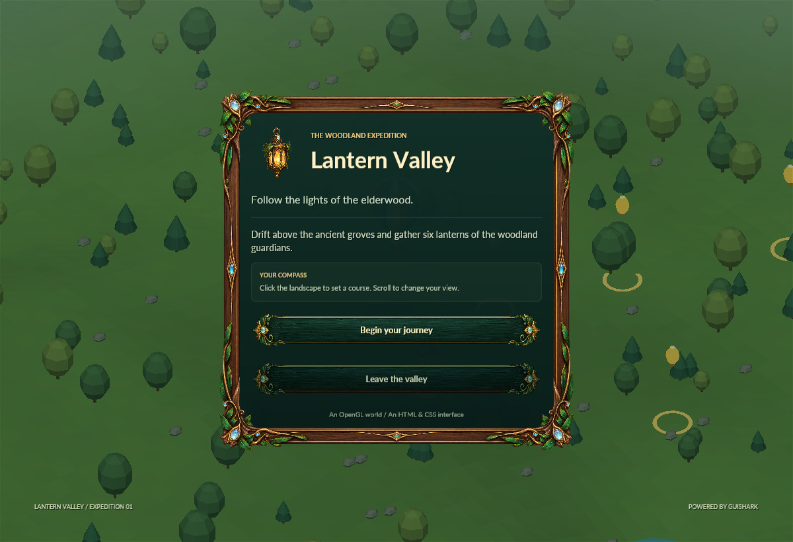

# Lantern Valley

A second host application showing GuiShark over a real 3D OpenGL scene. The procedural landscape, flight simulation, terrain picking, camera, and world renderer are independent of the UI SDK.

The woodland skin uses transparent painted PNGs for carved frames, leaf-and-gold buttons and a glowing lantern relic. All labels, layouts, states and callbacks remain HTML/CSS and C#. Its menus, pause screen, completion screen and HUD share the same artwork; collected lantern icons brighten individually. See [asset provenance and prompts](woodland-artwork.md).

Panel fills are inset beneath the carved frame's inner rim, leaving the outer leaves and ornament transparent. The PNG itself has a transparent center; CSS controls the backing color independently. Modal screens also dim the scene behind the window, while the HUD leaves the surrounding game undimmed. A sharp text shadow supports label readability.




## Run

From the repository root, with the .NET 10 SDK and an OpenGL 3.3 core driver:

```powershell
dotnet build Gui.Shark.sln
dotnet run --project src/GuiShark.Balloon
```

Use `-- --play` to skip the main menu. To load source HTML/CSS instead of the copied output assets:

```powershell
dotnet run --project src/GuiShark.Balloon -- --assets src/GuiShark.Balloon/Assets
```

The Lato font files are copied from the original playground's licensed assets into this demo's output. No additional downloads or external game assets are required.

## Play

- Click the landscape to set your balloon's destination. A golden ring marks your course.
- Fly near each of the six floating lanterns to collect it. The HUD shows progress, altitude and distance.
- Scroll over the world to zoom the angled orthographic camera.
- **Find the next lantern** sets a course to the closest remaining lantern.
- **Pause / Esc** pauses; **Keep drifting** or Escape resumes. Restart begins a new expedition.
- Native focus loss automatically pauses flight.
- Return to the main menu or finish collecting all six lanterns to see the corresponding HTML interface.
- Tab / Shift+Tab and Enter / Space navigate and activate menu/HUD buttons.
- F12 saves the actual framebuffer as a PNG in `artifacts/`.

Menu and HUD previews can also be exported from the executable without playing:

```powershell
dotnet run --project src/GuiShark.Balloon -- --capture artifacts/menu.png
dotnet run --project src/GuiShark.Balloon -- --play --capture artifacts/hud.png
```

The capture option renders three frames, writes the requested PNG, and exits. It is a screenshot export feature; it does not perform input checks or run a test suite.

## How the integration works

`BalloonWindow` owns the context and loop. Each frame calls `WorldRenderer.Render(...)` first, then `BalloonInterface.Render(...)`. GuiShark draws into the existing framebuffer, preserving the renderer state it touches. It never clears the landscape or its depth buffer.

`WorldRenderer` uploads a generated terrain/decorations mesh and separate balloon/lantern meshes. `SceneShader` performs directional lighting, distance fog and an approximate balloon shadow. `FollowCamera` smoothly follows the balloon and unprojects mouse coordinates onto the terrain. `Expedition` owns collectibles; `Flight` owns velocity, smooth steering and height above the hills.

`HtmlOverlay` wraps only the public `HtmlLoader`, `UiView`, and `OpenGlUiRenderer` APIs. `BalloonInterface` connects element IDs to C# actions and updates labels five times per second. Its menu, HUD, pause and completion documents are separate HTML files sharing one stylesheet. Modal views are drawn after the HUD and consume input before the game receives it.

Mouse presses are offered to GuiShark first. Only an unconsumed press during flight invokes terrain picking. Decorative HUD elements inherit `pointer-events: none`; actual controls restore `auto`. Thus clicking through a label still steers the balloon, while clicking Pause never also steers it. Logical content coordinates are used for both picking and UI input; actual framebuffer dimensions are used for rendering.

## SDK additions

- `pointer-events: auto/none`, with inherited behavior and descendant overrides.
- `position: absolute` with pixel/percentage edge anchors, excluded from normal flow.
- Transparent `background-image`, centered `background-size` / `object-fit` scaling.
- Nine-slice frame backgrounds with independently specified source slices and destination border widths.
- Inset color/gradient backing that stays inside decorative frames without affecting layout.
- Image tint for illustrated hover, pressed and disabled states, and collected relics.
- A single sharp `text-shadow` for readable labels over the game.
- Existing premultiplied texture blending and GL state restoration are reused unchanged.

These features are shared SDK functionality. No game behavior or window/input dependency was added to `GuiShark`.

## Scope and verification

The landscape is a seeded finite world, generated locally on startup. This is a stylized exploration demo, with simple steering rather than realistic balloon physics. There is no terrain streaming, tree collision, save system, audio, or shadow map. The shadow is a soft ground-darkening approximation. UI clipping remains rectangular, and the demo imposes a minimum window size to keep the HUD readable.

Debug and Release builds pass with zero warnings/errors. Actual OpenGL menu/HUD frames were inspected on Windows with an Intel UHD Graphics 630 OpenGL 3.3 driver, including inset panel backing and text shadows. User play-throughs confirmed the full original six-lantern flow and woodland-skin steering, collection and pause/menu transitions. Resize and physical DPI behavior have not been verified. No unit or integration tests were added.
