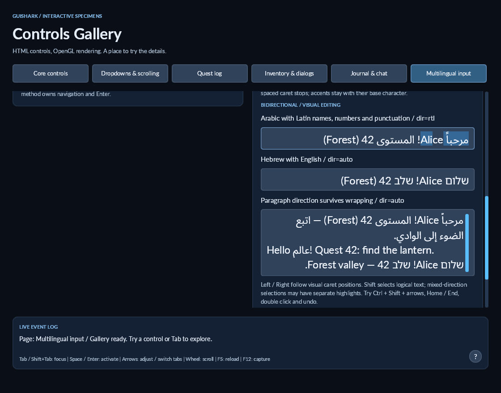

# Bidirectional text and visual editing

GuiShark resolves Unicode paragraph direction with the managed [Unicode.Bidi 0.3.18 library](https://github.com/erikbra/unicode-bidi-net), then shapes each visual font/direction run with the existing Skia/HarfBuzz backend. This adds no native dependency beyond the existing text stack. Resolution uses the complete logical paragraph before wrapping; wrapped lines keep their paragraph context. Numbers and Latin names remain left to right within Arabic/Hebrew paragraphs.

```html
<input dir="rtl" value="مرحباً Alice! المستوى 42 (Forest)">
<input dir="auto" value="שלום Alice! שלב 42 (Forest)">
<textarea dir="auto">مرحباً Alice!
Hello عالم! Quest 42.</textarea>
```

`dir` accepts `ltr`, `rtl` or `auto`. Missing direction inherits from ancestors; the root defaults to LTR. `auto` determines each text paragraph's base direction from its first strong character. For an empty or neutral-only paragraph it defaults to LTR. This is a text-level policy, not complete browser HTML direction semantics: an ancestor's `auto` policy is inherited, rather than scanning all its descendant content for one shared direction. Direction changes invalidate layout and text caches.

Default `text-align: start` aligns RTL paragraphs right and LTR paragraphs left. `end` does the opposite. Explicit `left`, `center`, and `right` retain physical alignment. Buttons keep their centered default. Direction does not mirror flex children, scrollbars, icons or general control layout.

## Editing behavior

- Left/Right move through visual caret positions; Home/End reach the physical left/right edge of the current line. Ctrl/Command+Home/End retain logical document start/end.
- Shift extends a logical UTF-16 selection. A contiguous logical selection can highlight multiple separate visual spans. Clipboard text remains in logical order.
- Ctrl+Shift+arrows (Option+Shift on macOS hosts) follow visual word runs. Double click selects the logical word under the pointer.
- Up/Down retain the visual horizontal coordinate. Wrapping retains existing upstream/downstream line affinity.
- Backspace/Delete keep their existing logical grapheme deletion behavior. Undo/redo and composition cancellation restore caret affinity.
- Masked password bullets use LTR ordering, concealing the source direction and preserving existing copy/cut protection. Revealed passwords use the field's configured direction.

At a direction boundary, one logical index may have two visual positions. `TextCaretPosition.Trailing` identifies the preceding grapheme's trailing edge; the default uses the following grapheme's leading edge. Mouse placement and navigation preserve this affinity. Selection offsets, public `Caret`, application callbacks and clipboard APIs remain logical UTF-16 indices.

## Custom metrics

Existing `ITextMetrics` implementations continue compiling through default overloads. For bidi-aware rendering, implement `MeasureWidth(TextLineContext, ...)` and `CreateCaretMap(TextLineContext, ...)`: context contains the full text, logical line range and direction. Construct `TextCaretMap` with each grapheme's leading/trailing visual edges and paragraph direction. Use `Selection` for disjoint highlight spans, and `NearestPosition`/`MoveVisual` for affinity-aware carets. The old coordinate constructor remains available for simple LTR metrics.

`SkiaTextBackend` supplies this behavior automatically. Its string-only measurement/caret overloads use automatic paragraph direction; UI layout passes the element's explicit/inherited direction. Local `@font-face` fallback still supplies fonts; load a font covering Arabic/Hebrew in the asset folder, as shown in [font fallback](font-fallback.md).

## Try it

```powershell
dotnet run --project src/demos/GuiShark.ControlsDemo -- --bidi
```

This opens Multilingual input scrolled to Arabic/Hebrew samples, with a mixed-direction selection. Edit either field, use the navigation shortcuts, or scroll its multiline specimen. `--capture` renders 30 frames, saves an OpenGL screenshot under `artifacts`, and exits.



The default shaped backend supports directional punctuation mirroring. Text Lab's unshaped diagnostic mode orders runs but does not provide Arabic joining or mirrored punctuation. Color emoji, font-provided ligature caret tables, script itemization within a single font, mixed inline HTML and vertical writing remain outside the supported subset. Unicode directional isolates are handled by the bidi library; HTML `bdi`/`bdo` are not supported.

Native Linux/macOS and actual OS IME candidate-window behavior still need platform checks; Windows rendering alone does not establish those results.

## Validation

Windows x64, .NET SDK 10.0.401: solution coverage includes all seven C# projects. Fresh Debug and Release builds pass with zero errors and 62 existing analyzer warnings (down from the 64-warning baseline after aligning metrics parameter names). All 86 tests pass in both configurations, including 17 bidi cases beyond the 69-test baseline. Tests cover direction inheritance, shaped RTL editing, disjoint selection, directional boundary affinity, digit order, paragraph context across wrapping, pointer/alignment agreement, IME cancellation, logical undo, word selection, passwords, isolates, marks and supplementary graphemes. A native Windows OpenGL 3.3 capture was inspected for joining, Latin/digit ordering, right alignment, wrapping and separated highlights. Linux/macOS native execution and physical keyboard/OS IME behavior were not verified in this milestone.
