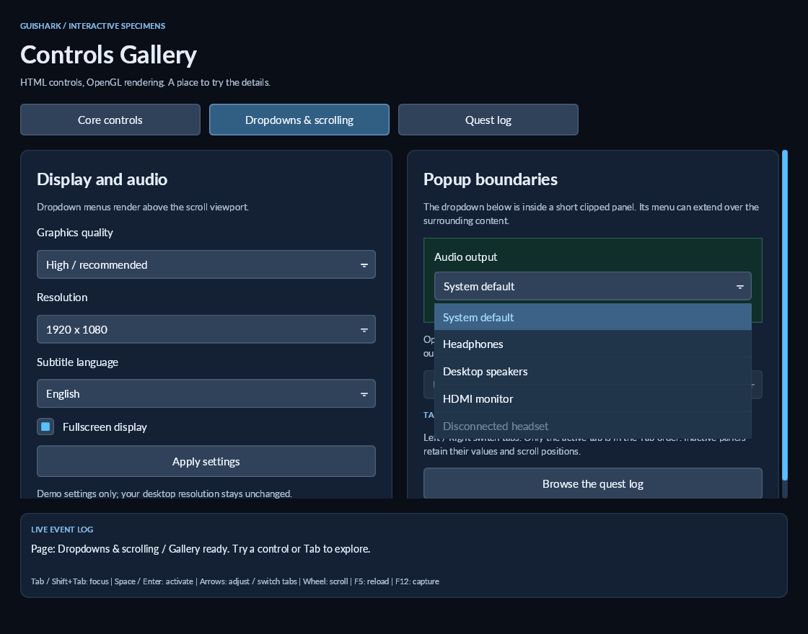
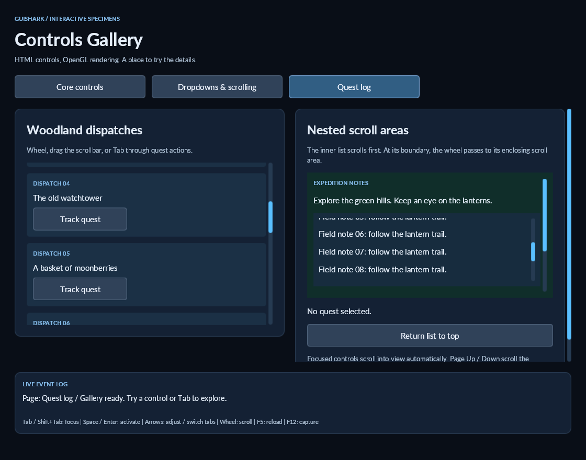
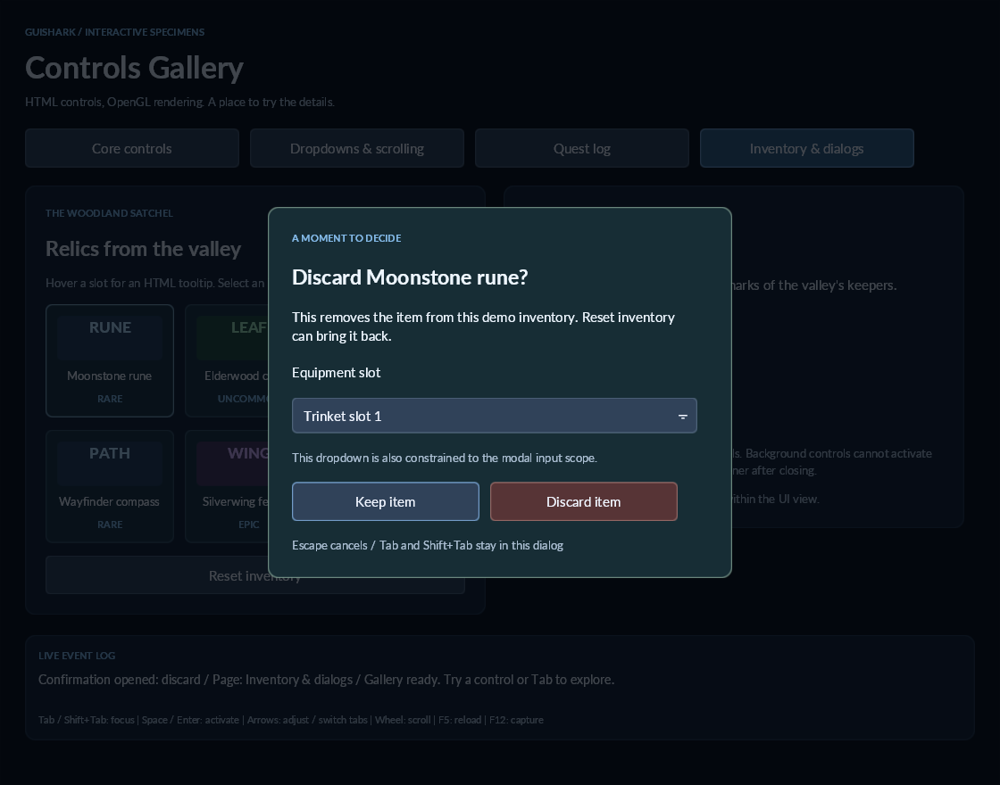
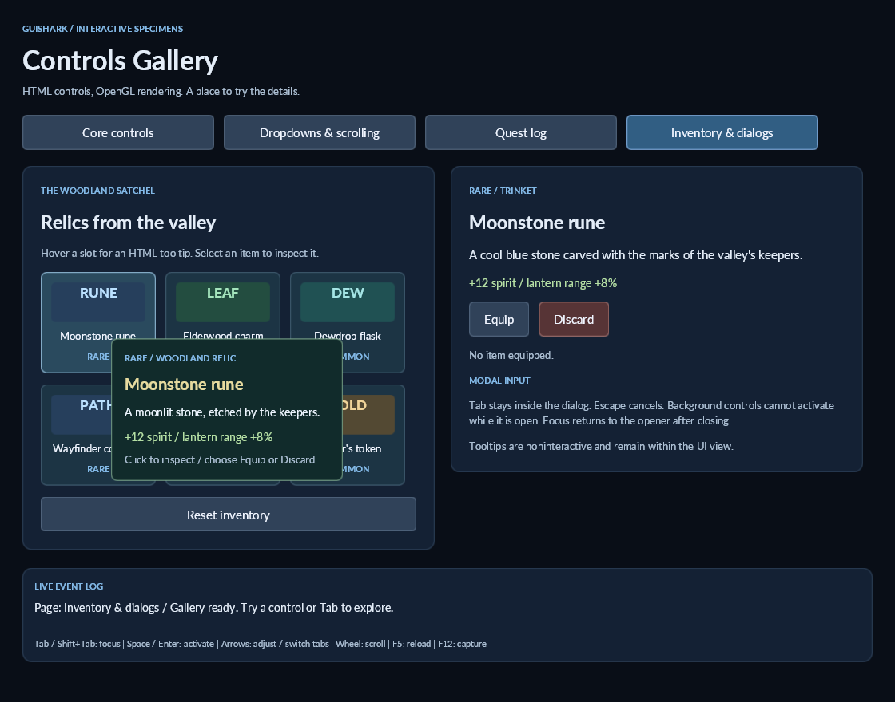
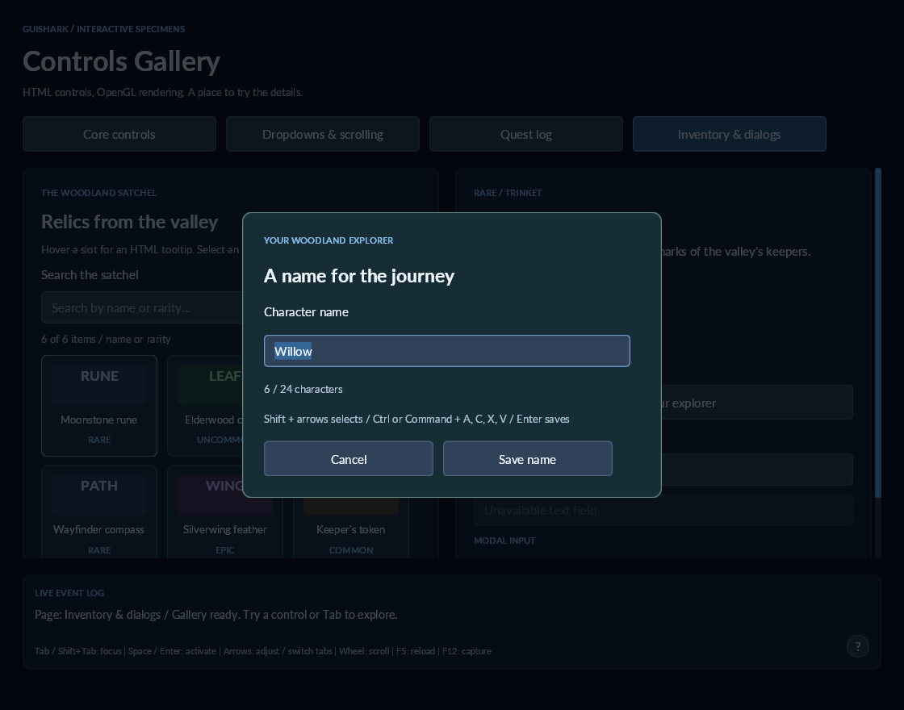
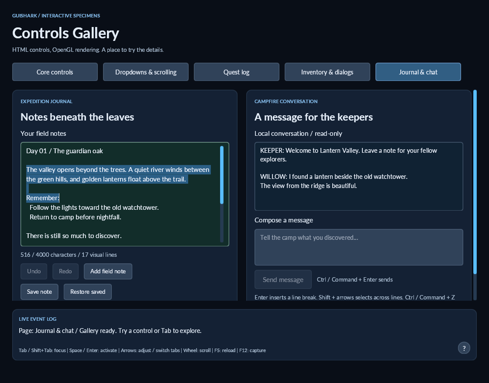
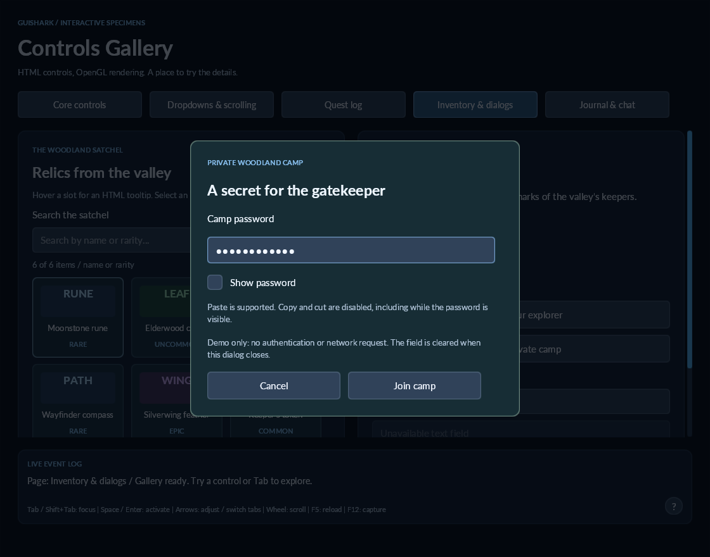

# Controls and the gallery

Run from the repository root:

```powershell
dotnet run --project src/demos/GuiShark.ControlsDemo
```

The gallery uses the same SDK rendering and input paths as an embedded game UI. Window hosting, application callbacks, and HTML/CSS assets have separate responsibilities. It includes six HTML-defined tab pages: Core controls, Dropdowns & scrolling, Quest log, Inventory & dialogs, Journal & chat, and Multilingual input. The original controls stay on their own page. Settings show view-level dropdowns; quests demonstrate nested scrolling and retained scroll positions. A bounded event log remains visible on every page. F5 reloads HTML/CSS and resets state; pass `src/demos/GuiShark.ControlsDemo/Assets` as a demo argument to edit source assets directly. F12 captures the actual framebuffer. `--capture` saves a screenshot after 30 frames and exits.

## Markup

```html
<div class="row">
  <input id="subtitles" type="checkbox" checked>
  <label for="subtitles">Show subtitles</label>
</div>
<input id="easy" type="radio" name="difficulty">
<input id="normal" type="radio" name="difficulty" checked>
<label for="volume">Master volume</label>
<input id="volume" type="range" min="0" max="100" step="1" value="65">
<progress id="loading" max="100" value="65"></progress>
```

Radio buttons with the same nonempty `name` are exclusive within a document. If multiple initially have `checked`, the last wins. An unnamed radio is independent. Labels use `for` to target a control, or contain a control as a child; mixed text and children still require a separate span. Disabled or hidden targets cannot activate. Progress is determinate and noninteractive.

Ranges default to min 0, max 100, step 1, and their midpoint. Progress defaults to max 1 and value 0. Values clamp to the declared bounds; sliders also snap to a step relative to min. `step="any"` disables snapping. Invalid numeric declarations fail with a clear format error. Bounds must be finite and max must exceed min; range step must be nonnegative. Attributes initialize retained state: change the C# control state afterwards.

```csharp
var volume = document.GetElement("volume").Control!;
volume.Changed += control => audio.MasterVolume = control.Value / 100;
volume.Value = 75;
document.GetElement("subtitles").Control!.Checked = false;
document.GetElement("volume").Disabled = true;
```

`Changed` fires only when a value actually changes, for user and programmatic changes. Radio deselections notify too. Progress changes also notify, so handlers that update linked controls should avoid feedback loops. Buttons retain their `Clicked` event. Range changes are immediate while dragging; there is no separate committed-change event yet. Input interactions respect disabled state; application code can still update disabled controls.

## Theme and custom CSS

```csharp
var document = HtmlLoader.Load(html, assets, UiTheme.Neutral);
```

`UiTheme.Neutral` supplies readable control backgrounds, borders, hover/pressed/focus states, radio circles and disabled opacity. The root stays transparent. The default remains `UiTheme.None` for compatibility with existing skins. Application CSS is applied after the base theme, including inline styles. There is no automatic font discovery: load fonts using the documented `@font-face` workflow before laying out the view.

Normal CSS dimensions, backgrounds, borders and colors apply to controls. `:checked` matches checkbox/radio checked state. `-guishark-accent-color` styles marks, slider fill/thumb and progress fill; it is an element property, not inherited. This first renderer uses a solid square checkbox mark and a round radio dot. See the gallery CSS for a complete skin example.

## Input integration

Forward logical-pixel mouse coordinates to `view.Input.PointerMove`, `PointerDown`, and `PointerUp`, as with buttons. Range dragging retains capture outside its bounds; use `HasPointerCapture` when deciding whether the game should receive mouse movement. Call `Cancel` when the host loses focus.

Forward key press/release to the SDK:

- Tab / Shift+Tab move through enabled interactive controls.
- Enter / Space activate buttons, checkboxes and radios.
- Left / Down decrease a range; Right / Up increase it. Home / End select its bounds. `step="any"` uses one percent of the range for keyboard increments.
- Arrows move and select within a named radio group, skipping unavailable members.
- Escape clears focus/capture.

Hosts must map the new `UiKey.Left`, `Right`, `Up`, `Down`, `Home`, and `End` values. The gallery demonstrates this mapping. Progress is excluded from focus navigation. Radio groups currently keep each available member in the Tab order.

## Coverage

Release builds and a real OpenGL framebuffer capture were checked on Windows. The user confirmed the original gallery controls work. New dropdown/tab/scroll/dialog/tooltip interactions and Linux/macOS execution still need manual verification. No unit or integration tests were added.

Text inputs and textareas support editing; IME composition remains future work. This is a bounded HTML UI SDK, not a full browser form implementation.



## Dropdowns

```html
<label for="quality">Graphics quality</label>
<select id="quality">
  <option value="medium">Medium</option>
  <option value="high" selected>High</option>
  <option value="ultra" disabled>Ultra / unavailable</option>
</select>
```

```csharp
var quality = document.GetElement("quality").Select!;
quality.Changed += select => graphics.SetQuality(select.Value);
quality.SelectedIndex = 0;
```

Single-choice `select` accepts direct `option` children. Options default their value to their text. The last `selected` declaration wins, otherwise the first enabled, non-hidden option is selected. An empty select has index -1. Programmatic selection can use -1 to clear it, or select a disabled option; interactive navigation skips disabled options. `multiple`, `size`, option groups and type-to-search are not supported yet.

Click or Enter/Space opens a menu; Up/Down on a focused select also opens it. Arrows/Home/End highlight options, Enter/Space commits, and Escape cancels while retaining focus. Tab closes the menu and continues normal focus navigation. The wheel scrolls long menus. Selection changes notify once, after commit; highlights do not change the value. Menus show up to eight rows, constrained to the view, and open above when more space is available. The option count is not otherwise limited.

Each view owns one `view.Popup`, drawn after ordinary content with clipping to the view, rather than to the select's ancestors. Option CSS controls row appearance; `:selected` matches selected options and active tabs. `view.Popup.Open(selectElement)` and `Close()` also allow application-driven menus. Hidden/disabled owners close automatically. Menus remain within the UI view, not a native operating-system popup.

Pointer events go to the open popup first. An outside pointer down closes it and consumes the corresponding release, so it cannot activate underlying controls or the game. `HasPointerCapture` and `WantsKeyboard` include the open popup. Hosts should respect the input methods' consumed return values, as with the existing controls.

## HTML tabs

```html
<div role="tablist">
  <button role="tab" aria-controls="settings" aria-selected="true">Settings</button>
  <button role="tab" aria-controls="quests">Quests</button>
</div>
<section id="settings" role="tabpanel"> ... </section>
<section id="quests" role="tabpanel"> ... </section>
```

Tabs use direct button children of a `role="tablist"`, with distinct `aria-controls` targets carrying `role="tabpanel"`. These HTML attributes initialize GuiShark behavior; they do not provide an OS accessibility bridge. Use CSS to arrange the strip as a row. Nonselected panels are hidden from layout, drawing, hit testing and focus navigation while retaining state. The active tab matches the GuiShark `:selected` pseudo-class. Left/Right switch available tabs; Home/End select the ends. Only the active tab participates in normal Tab navigation.

```csharp
var tabs = document.TabGroups[0];
tabs.Changed += group => Console.WriteLine(group.Selected.Text);
tabs.Select(document.GetElement("quest-tab"));
```

`UiElement.Hidden` provides programmatic visibility, also initialized by the HTML `hidden` attribute. It always hides the subtree even if CSS specifies `display: flex`. Keep tab visibility under the tab group's control. Panels may be placed elsewhere in the document; nested tab groups need distinct panel targets.



## Vertical scrolling

```css
.quest-list { height: 300px; overflow-y: auto; gap: 12px; }
```

Apply `overflow-y: auto` or `scroll` to a bounded container with child elements. Content is clipped to the viewport; offset and scrollbar geometry use logical pixels. The engine reserves a 12px gutter for scrollbars on scroll containers, even when no scrollbar is needed, to avoid width changes as content grows. A scrollbar is drawn only when content exceeds the viewport. `overflow-y: hidden` keeps the existing clipping behavior and disables scrolling. Horizontal scrolling, smooth animation, touch gestures and virtualization are not included.

Forward the mouse wheel in addition to existing mouse events:

```csharp
view.Input.PointerWheel(mouseX, mouseY, wheelDeltaY);
```

Positive deltas scroll up; one unit moves 40 logical pixels. Nested containers consume scrolling first, then pass it to ancestors once they reach a boundary. The scrollbar thumb can be dragged; clicking its track moves the thumb toward the pointer. Wheel handling for the UI returns whether the input was consumed.

Tab focus can reach off-screen controls and scroll them into view. Forward `UiKey.PageUp` and `PageDown` to scroll the focused control's closest scroll container. Focus is retained if a wheel/page movement scrolls it off-screen, but activation requires the control to be visible. Programmatic positions use `element.Scroll.Offset` (clamped) and read `Maximum`; update the view after showing a panel before setting a position, so its extent is known.

For reproducible visual inspection, the gallery accepts `--page=basics|settings|lists|inventory`, `--dropdown=device` (or another select ID), and `--scroll`. These can be combined with `--capture`, for example:

```powershell
dotnet run --project src/demos/GuiShark.ControlsDemo -- --page=settings --dropdown=device --capture
dotnet run --project src/demos/GuiShark.ControlsDemo -- --page=lists --scroll --capture
```

## Modal dialogs

```html
<button id="discard">Discard</button>
<dialog id="confirm">
  <h2>Discard this item?</h2>
  <p>The item will be removed from your inventory.</p>
  <div class="actions">
    <button id="cancel" autofocus>Keep item</button>
    <button id="accept">Discard item</button>
  </div>
</dialog>
```

```csharp
var dialog = document.GetElement("confirm").Dialog!;
document.GetElement("discard").Clicked += _ => dialog.ShowModal();
document.GetElement("cancel").Clicked += _ => dialog.Close("cancel");
document.GetElement("accept").Clicked += _ => dialog.Close("discard");
dialog.Closed += closed =>
{
    if (closed.ReturnValue == "discard") inventory.DiscardSelectedItem();
};
```

Create a `UiView` before opening a dialog. Dialogs start closed, contribute no space to normal layout, and render in a view-level layer when `ShowModal()` is called. The HTML `open` attribute is rejected: use the C# method to establish modal focus/input state. The default layout centers the dialog in the view, clamps it to the available dimensions, and uses a vertical scroll viewport if its children exceed the available height. Regular CSS styles its contents; the neutral theme provides an opaque surface and border. Root CSS top/left offsets are not applied to this centered overlay.

Each view supports one modal at a time. Opening a different modal while one is active throws; close the current one first. Place reusable dialogs outside tab panels, normally as children of `body`. A modal closes with result `cancel` if its node or an ancestor becomes hidden or disabled. Nested modal stacks and nonmodal dialogs are not implemented.

Opening cancels existing input captures, dropdowns and tooltips, remembers keyboard focus, and moves focus to the first enabled `autofocus` control or the first available control. Tab / Shift+Tab wrap within the dialog. Background elements cannot receive pointer hits or keyboard focus. Backdrop clicks are consumed and do not dismiss a confirmation. `Close(result)` restores the previous focus target if it remains available, then raises `Closed`. Escape closes with result `cancel` and additionally raises `Cancelled`; set `CloseOnEscape = false` to require an explicit action. Escape closes an open dropdown first, before cancelling its dialog. Closing an already-closed dialog has no effect.

`view.Modal.Active`, `IsOpen`, and `BackdropColor` expose the layer's state and backdrop color. `view.Input.Focus(element)` supports application-driven focus within the current scope. `HasPointerCapture` and `WantsKeyboard` stay true for an open modal, including dialogs without focusable controls. Forward and respect the consumed input results. Game hosts must also gate keyboard keys not represented by `UiKey` using `WantsKeyboard`, and must stop their own shortcuts/input when the modal consumes them; the SDK cannot block input the host never forwards. Losing window focus should still call `Input.Cancel()`: this clears captures/tooltips without closing the modal.

A dropdown inside a dialog uses the existing popup layer, above the dialog surface, and accepts only owners within the modal scope. Closing the dialog closes that popup. View disposal clears layers and detaches dialog state without invoking application close callbacks.



## Tooltips

Plain text uses the HTML `title` attribute:

```html
<button title="Restore the inventory and clear equipped items.">Reset inventory</button>
```

Rich descriptions use HTML with `role="tooltip"` and an associated owner:

```html
<button aria-describedby="moonstone-tip">Moonstone rune</button>
<section id="moonstone-tip" role="tooltip" class="item-tooltip">
  <h3>Moonstone rune</h3>
  <p>Rare woodland relic</p>
  <p>+12 spirit / lantern range +8%</p>
</section>
```

Tooltip blocks are excluded from normal flow, drawing and hit testing. Do not use HTML `hidden` or `display: none` on them: the tooltip layer controls whether they are drawn. For this bounded implementation, `aria-describedby` accepts one ID whose target must carry `role="tooltip"`; general ARIA descriptions and an OS accessibility bridge are not implemented. The rich HTML target takes precedence over `title` on the same owner.

Hovering an owner or its children starts a 450ms delay. Moving within the same owner preserves the timer; leaving resets it. `view.Tooltips.Delay` changes the delay with a nonnegative `TimeSpan`. Regular `view.Update()` / renderer calls advance timing through a monotonic clock, so hosts need no timer or platform-specific text API. Tooltip positioning prefers below/right of the pointer, flips above when needed, and clamps to the view. Oversized content is clipped to the available view area. Tooltip content does not take focus or pointer hits. Keyboard-focus tooltip activation is not included yet.

Pointer down, scrolling, a dropdown or modal opening, and focus loss suppress the tooltip. Owners within the active modal can still show their own descriptions. Hidden owners/panels suppress pending or visible tooltips. `view.Tooltips.Hide()` allows explicit suppression. Plain tooltips use a synthetic `.guishark-tooltip` element and inherit the owner's font; rich tooltips use their declared CSS. Styles and the selected text backend are shared with the rest of the UI.

The fourth gallery page contains six selectable items. Equip/Discard opens a confirmation, completing the action updates the inventory and live log, and Reset restores it. The dialog dropdown demonstrates popup integration. The footer `?` demonstrates placement at the view boundary.

```powershell
dotnet run --project src/demos/GuiShark.ControlsDemo -- --page=inventory
dotnet run --project src/demos/GuiShark.ControlsDemo -- --page=inventory --modal=discard --capture
dotnet run --project src/demos/GuiShark.ControlsDemo -- --page=inventory --modal=equip --dropdown=equipment-slot --capture
dotnet run --project src/demos/GuiShark.ControlsDemo -- --page=inventory --tooltip=item-rune --capture
```

`--tooltip` takes an owner element ID; `--modal` accepts `equip`, `discard`, `name` or `password`. These options set up repeatable visual captures, not an automated input test suite.




## Single-line text input

```html
<label for="name">Character name</label>
<input id="name" type="text" value="Willow" placeholder="Enter a name..." maxlength="24">
```

`type="text"` is also the default for an input without a type. `value`, `placeholder`, `maxlength`, `readonly`, `disabled`, and `autofocus` are supported. Text fields currently remain left aligned even if CSS requests another text alignment. Fonts use the same CSS `@font-face` and `font-family` declarations as labels; the active view text backend supplies both glyph rendering and caret measurements. The neutral theme supplies a field surface, border, focus indication and disabled appearance without application CSS.

```csharp
var name = document.GetElement("name").TextInput!;
name.Changed += field => UpdatePreview(field.Value);
name.Submitted += field => SaveCharacter(field.Value);
name.Value = "Willow";
name.SelectAll();
```

`Value` is the editable value; `UiElement.Text` is its display text, including the placeholder when empty. Change the value through `TextInput.Value`, rather than assigning `UiElement.Text`. `Changed` fires for value changes, including programmatic changes; selection alone does not fire it. `Submitted` fires on Enter. `Select(start, length)` and the caret/selection properties use UTF-16 offsets snapped to grapheme boundaries. `MaximumLength` also counts UTF-16 units, as HTML maxlength does; supplementary characters can occupy two units. Insertion truncates at a complete grapheme, and control characters/newlines are removed.

Click positions the caret; dragging or Shift-click extends selection. Left/Right, Home/End and Shift selection, Backspace/Delete, Select All, Copy/Cut/Paste, a blinking caret and horizontal caret scrolling are supported. Read-only fields allow focus, selection and copying. Disabled fields do not take focus. Tabs and modal focus rules also apply to fields. Selection is painted beneath the text and clipped to the field; the Skia backend rasterizes only the visible input width, even for long values.

The host forwards committed Unicode text separately from physical key events:

```csharp
// OpenTK GameWindow overrides:
protected override void OnTextInput(TextInputEventArgs args)
{
    base.OnTextInput(args);
    view.Input.TextInput(args.AsString);
}
// Map Backspace/Delete/A/C/X/V in addition to the existing UiKey mappings.
// args.Command represents the macOS Command modifier.
view.Input.KeyDown(key, args.Shift, args.IsRepeat, command: args.Control || args.Command);
```

Set `view.Input.Clipboard` to a host implementation of `IUiClipboard.GetText()` / `SetText(string)`. The gallery uses OpenTK's window clipboard property; the SDK has no Windows-only clipboard dependency. Call on the window thread and handle clipboard failures according to your host's policy. If no provider is installed, clipboard shortcuts are consumed without changing the field. Pass Shift to `PointerDown(x, y, shift)` for Shift-click. Gate game shortcuts and key polling with `WantsKeyboard` / consumed input results so typing cannot also trigger game actions.

The inventory page now includes live search by item name/rarity, read-only and disabled fields, and a character-name dialog with autofocus, length limit, selection and Enter-to-save. Run it with any of the three view-wide backends:

```powershell
dotnet run --project src/demos/GuiShark.ControlsDemo -- --page=inventory
dotnet run --project src/demos/GuiShark.ControlsDemo -- --page=inventory --modal=name
dotnet run --project src/demos/GuiShark.ControlsDemo -- --page=inventory --modal=name
```

Skia + HarfBuzz is the default. Editing preserves Unicode graphemes and supports bidirectional caret layout; typing coalescing remains future work. Local font fallback and shaped caret geometry are supported. The Multilingual tab demonstrates IME preedit. Runtime execution has been checked on Windows; Linux/macOS native behavior still needs verification. Managed regression tests cover the editing model.




## Textareas and edit history

```html
<label for="notes">Expedition notes</label>
<textarea id="notes" rows="6" maxlength="4000" placeholder="Record your discoveries...">Day 01
Follow the lanterns.</textarea>
```

Textareas expose the same `UiElement.TextInput` / `UiTextInput` API as single-line fields. `IsMultiline` identifies the mode. Initial text comes from the HTML element's contents (rather than a value attribute), preserving spaces and line breaks. `rows` sets the natural height in lines, defaults to four, and accepts 1–1000; CSS height takes precedence. CSS fonts, colors, backgrounds, borders and focus states work as for text inputs. `readonly`, `disabled`, `maxlength`, `placeholder` and `autofocus` are supported. CRLF/CR line endings normalize to LF; other control characters, including tabs, are removed. Use spaces for indentation. Textareas always wrap and use vertical scrolling; resizing handles and wrap=off are not supported.

Visual lines preserve whitespace and wrap at spaces or complete graphemes for long words. A shared layout computes line ranges, caret coordinates, pointer hit positions and selection rectangles using the current backend's metrics. Skia rasterizes only the visible field dimensions. Paragraph direction and visual editing use the [bidirectional text contract](bidirectional-text.md).

Enter inserts a line break. Ctrl/Command+Enter raises `Submitted` for an application action such as sending a message. Tab/Shift+Tab move focus. Up/Down preserve the desired column, Home/End navigate the current visual line, Ctrl/Command+Home/End navigate the document, and Page Up/Down move by a viewport of lines. Shift extends selection. Mouse click/drag and Shift-click work across lines. Wheel scrolling and the scrollbar reuse `UiScroll`; moving/editing the caret brings it into view, while manual scrolling can move away from it. `SelectionRects` exposes all line rectangles (`SelectionBounds` retains the first rectangle for compatibility).

Both single-line fields and textareas now support undo/redo:

```csharp
var notes = document.GetElement("notes").TextInput!;
notes.InsertText("\nA lantern waits beside the river."); // undoable, replaces the selection
if (notes.CanUndo) notes.Undo();
if (notes.CanRedo) notes.Redo();
notes.Submitted += field => SendLocalMessage(field.Value);
```

Ctrl/Command+Z undoes; Ctrl/Command+Shift+Z or Ctrl/Command+Y redoes. The host must map `UiKey.Z` and `UiKey.Y` alongside the existing keys. History stores up to 100 edit snapshots with text, caret and selection state. Each committed insertion, paste, deletion or selection replacement is an edit; typing is not coalesced into words yet. A new edit clears redo. Changing `Value` programmatically or changing `MaximumLength` resets history, which is useful when loading a different document. `InsertText` retains history and respects read-only state and length limits. Read-only fields do not undo/redo. `Changed` reports restored values too; caret-only movement and scrolling do not create edits.

The fifth gallery tab, **Journal & chat**, provides editable notes with Undo/Redo, adding a sample field note, and saving/restoring an in-memory snapshot. The local chat includes a read-only conversation and multiline composer, with Send or Ctrl/Command+Enter. Neither feature writes files or sends network messages. Reloading resets them.

```powershell
dotnet run --project src/demos/GuiShark.ControlsDemo -- --page=journal
dotnet run --project src/demos/GuiShark.ControlsDemo -- --page=journal --select-notes --capture
dotnet run --project src/demos/GuiShark.ControlsDemo -- --page=journal --scroll --capture
dotnet run --project src/demos/GuiShark.ControlsDemo -- --page=journal
```

The selection and scroll flags configure visual captures, not an automated input test suite. Windows OpenGL captures were reviewed for multiline rendering, selection and scrolling. Actual mouse/keyboard and clipboard interactions still need manual evaluation; Linux/macOS native execution remains unverified. Managed regression tests cover editing and composition; typing coalescing remains follow-up work.




## Word navigation and double-click selection

Text inputs and textareas now share word editing behavior, including read-only fields:

- Double-click selects the word under the pointer; dragging after the second click extends by whole words.
- Ctrl+Left/Right on Windows/Linux moves by word; add Shift to extend selection.
- Option+Left/Right on macOS moves by word; add Shift to extend selection.

Words group Unicode letters/digits, combining marks and underscores. Apostrophes between word characters belong to the word (for example, `keeper's`). Whitespace and punctuation form separate runs; emoji and other symbols remain complete individual graphemes. Navigation skips whitespace between runs. Soft wrapping does not create word boundaries, but line breaks act as whitespace. This is a predictable editing rule, not dictionary-based segmentation for languages such as Chinese or Thai.

Double-click detection lives in `UiInput`, using a monotonic clock, a 500ms interval and a four-logical-pixel tolerance within the same enabled field. Moving beyond that tolerance, scrolling, keyboard input or input cancellation resets the sequence. These thresholds are portable defaults rather than OS preference settings. Existing PointerDown/Move/Up forwarding needs no additional mouse event.

The host distinguishes word navigation from clipboard/undo shortcut modifiers:

```csharp
view.Input.KeyDown(key, args.Shift, args.IsRepeat,
    command: args.Control || args.Command,
    wordNavigation: OperatingSystem.IsMacOS() ? args.Alt : args.Control);
```

`wordNavigation` is an optional final argument. When omitted, it follows `command`, preserving convenient Ctrl behavior for existing hosts; macOS hosts should pass Option explicitly. Word selection only changes caret/selection state, does not raise `Changed`, and does not add undo history. Linux/macOS native interaction and actual double-click/keyboard behavior still need manual verification.


## Password fields

```html
<input id="password" type="password" placeholder="Camp password" maxlength="64">
```

Password fields reuse single-line editing, selection, paste and undo/redo. Rendering displays one bullet per Unicode grapheme, with caret and selection widths measured from those bullets. Placeholder text remains readable. The bundled Lato font contains the default U+2022 bullet. The actual text stays in `TextInput.Value`; `UiElement.Text` and renderer display lines contain the mask while hidden.

```csharp
var password = document.GetElement("password").TextInput!;
password.ShowPassword = true; // connect to your show/hide checkbox
password.ShowPassword = false;
```

`IsPassword` identifies the field. Copy/cut shortcuts are consumed without changing the clipboard or value, even when revealed. Paste works through the host clipboard provider. Double-click selects the entire password; word navigation uses grapheme movement to avoid exposing internal word structure. Masking/revealing changes display state without firing `Changed` or adding an undo entry. Masking is visual only: values and undo snapshots remain ordinary strings in application memory; the SDK does not provide credential storage or authentication.

The inventory page displays an inline password field with Show password and Join camp controls. Its **Open password dialog** button opens a separate password demo with a Show password checkbox. Join produces a demo event without logging the value or sending a network request. Closing clears the field and resets reveal state.

```powershell
dotnet run --project src/demos/GuiShark.ControlsDemo -- --page=inventory --modal=password
```

Windows OpenGL password captures were reviewed with Skia. Native editing, clipboard and reveal interactions still need manual evaluation; managed tests cover password behavior.



The inline field and dialog keep independent values and reveal settings. Enter or Join camp submits the inline demo action, clears its field and hides the password again, without logging or sending its contents.

## Multilingual input

Run `dotnet run --project src/demos/GuiShark.ControlsDemo -- --page=multilingual` to try the sixth tab. The gallery now uses SDL for committed text, IME preedit, candidate-window placement, mouse input and clipboard integration. SDK APIs remain independent of SDL. All gallery pages use Skia + HarfBuzz; backend-selection flags have been removed.

The tab includes Japanese input, wrapped CJK notes, Devanagari input, a shaped Arabic label and composition event diagnostics. Preview kana / Convert / Commit / Cancel provide a portable SDK exercise without installing an OS input method. Actual IME testing requires selecting an input method in your OS. `--page=multilingual --compose --capture` captures an underlined preedit through the SDK API; it does not verify the OS candidate window.

See [composition contract, native hosting and limitations](multilingual-input.md).
