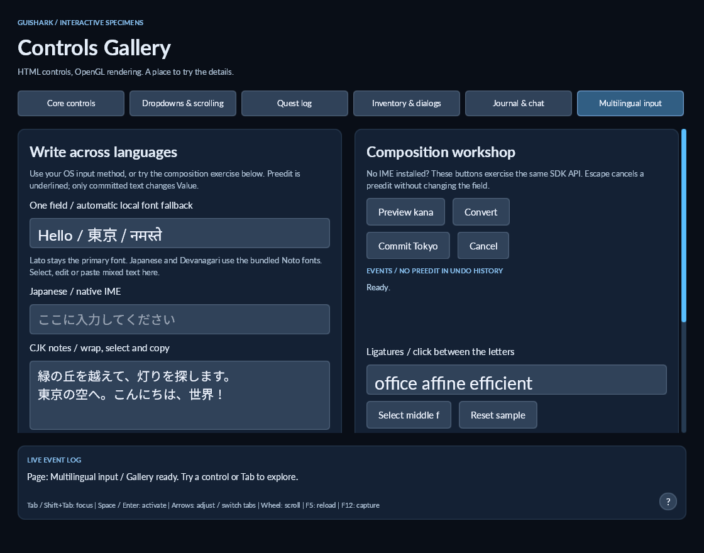

# Local font fallback

GuiShark uses the chosen font when it contains the required glyphs. Otherwise it chooses another loaded font for the whole Unicode grapheme. Adjacent graphemes using the same typeface are shaped and drawn together. Measurement, wrapping, caret coordinates, selections and IME preedit use the same runs.

Copy the fonts into your assets and declare them with CSS. No OS installation or runtime download is needed:

```css
@font-face { font-family: "Lato"; src: url("fonts/Lato-Regular.ttf"); }
@font-face { font-family: "NotoJP"; src: url("fonts/NotoSansJP.ttf"); }
@font-face { font-family: "NotoIndic"; src: url("fonts/NotoSansDevanagari.ttf"); }
body { font-family: "Lato", "NotoJP", "NotoIndic"; }
```

Load as before with `new FontBook(document, "Lato")` and `new OpenGlUiRenderer(view, fonts)`. Explicit stack families take priority from left to right. Other loaded families are then considered in registration order. A single family declaration also gets automatic fallback from the loaded font book. The bold face is preferred within each family; if it is absent, that family's regular face is used.

Unavailable stack entries are skipped. A stack with no loaded entries fails clearly, preserving the existing error for an unknown single family. Generic names such as `sans-serif` do not invoke OS matching; they must be declared as a local family to resolve. `@font-face` still accepts only one family name. The bounded CSS grammar does not accept commas, quotes or escaped characters inside a family name.

Coverage checks ignore format controls and variation selectors that need not have their own glyph. Whitespace and punctuation stay with the preceding font when it covers them. A grapheme is never divided across fonts. If no loaded font covers the entire grapheme, its primary font renders the missing glyph; GuiShark does not download or silently substitute OS fonts. This makes font choice deterministic across machines with the same assets.

All font runs share the primary font's baseline and requested size. Supply sufficient `line-height` for fonts with tall accents or marks. Fallback is based on character coverage, not proof of support for every OpenType sequence or variation. There is no script itemization within a single font, bidirectional paragraph reordering, RTL visual navigation or color emoji support yet. Mixed Latin/Japanese/Devanagari is demonstrated; mixed Arabic/Latin is still diagnostic.

Font books own their typefaces and bounded coverage caches. Backends borrow the book and invalidate image/caret caches when new fonts are loaded. Existing font registrations are immutable; create a new book when changing their bytes. Keep the existing disposal order: renderer/backend before font book, and graphics resources before the OpenGL context.

## Try it

```powershell
dotnet run --project src/demos/GuiShark.ControlsDemo -- --page=multilingual
```

The **One field / automatic local font fallback** specimen combines English, Japanese and Devanagari under a single CSS font stack. Try selecting, editing and pasting mixed text. The same fallback applies to ordinary labels and other controls, and to both Text Lab shaping modes.

## Validation

Windows x64, .NET SDK 10.0.401: fresh Debug and Release builds cover all seven C# projects with zero errors and the unchanged 64 analyzer warnings. All 69 tests pass in each configuration, including 21 new fallback and asset-path cases beyond the shaped-editing milestone. Tests cover explicit and automatic font selection, missing bold faces, whole-grapheme fallback, caret/selection consistency at 1.5x raster scale, font-load cache invalidation, malformed stacks and asset-directory containment. Both shaped and unshaped backends are exercised.

A native Windows OpenGL capture was visually inspected for the English/Japanese/Devanagari field and common baseline. Linux/macOS native execution, full bidi editing and real IME candidate placement were not verified here.


