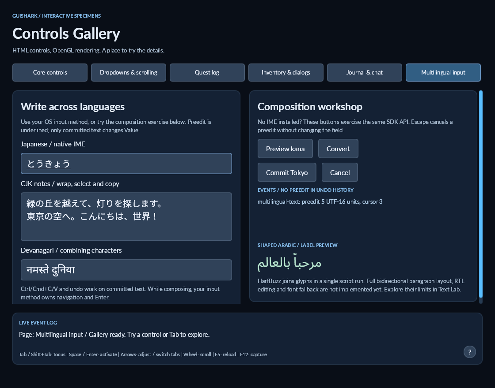

# Multilingual input and shaping

Controls Gallery now hosts genuine SDL text-input and text-editing events. GuiShark stores preedit independently of the committed value and displays it underlined at the selection. Text Lab compares the same Skia rasterizer with HarfBuzz shaping enabled and disabled.

```powershell
dotnet run --project src/demos/GuiShark.ControlsDemo -- --page=multilingual
dotnet run --project src/demos/GuiShark.TextDemo -- --sample arabic
dotnet run --project src/demos/GuiShark.TextDemo -- --mode harfbuzz --sample indic
```

The gallery also provides a composition exercise: Preview kana, Convert, Commit Tokyo and Cancel. This exercises the SDK without installing an input method. To try native composition, select a Japanese input method in your OS and type into the Japanese field. Preedit updates appear in the tab's event log. The SDK exercise is not evidence that an OS input method or candidate window works.



## Host contract

Continue forwarding committed Unicode text with `view.Input.TextInput(text)`. Forward preedit separately:

```csharp
view.Input.UpdateComposition(preedit, selectionStart, selectionLength);
// Empty preedit cancels; it does not delete the original selection.
view.Input.UpdateComposition("");
// A native commit replaces the original selection in one undoable edit.
view.Input.TextInput(committedText);
```

Offsets are UTF-16 indices within the preedit string. They must be in range and must not split a surrogate pair. Convert offsets from the host's own units before forwarding them. The SDL adapter converts Unicode character offsets to UTF-16.

`UiTextInput.Composition` exposes the current immutable snapshot; `CompositionChanged` reports updates and endings. `Value`, `SelectedText`, `Changed` and undo history concern committed text. `CaretBounds` follows the visible preedit caret; `CompositionRects` provides underline rectangles for wrapped preedit. Programmatic value/selection changes, focus loss, pointer presses, Tab, disabled/hidden controls and read-only transitions cancel preedit. Password fields mask preedit and retain their existing clipboard protection.

During composition, editing/navigation keys and Enter are consumed by the SDK without mutating the committed value. Your OS input method still receives physical keys through its native event loop. Escape cancels SDK composition before dismissing a modal. Hosts must also stop/reset native composition when the SDK changes focus or cancels preedit; otherwise an input method can deliver stale updates to a newly focused field.

## SDL example

The gallery's [SDL host](../src/demos/GuiShark.ControlsDemo/Hosting/SdlInput.cs) remains demo code; neither SDK library depends on SDL. Its responsibilities are:

- Start text input only for an editable focused field, restart it when the field changes, and stop it on focus loss.
- Forward `SDL_TEXTEDITING` and extended editing events as preedit; forward `SDL_TEXTINPUT` as committed text.
- Free SDL-owned extended editing and clipboard buffers.
- Position the native candidate window using the visible caret in logical window coordinates, independently of framebuffer DPI.
- Forward mouse, keyboard and clipboard operations through the existing SDK APIs.

SDL documents the event flow in its [text-input tutorial](https://wiki.libsdl.org/SDL2/Tutorials-TextInput). Other window libraries can implement the same GuiShark contract. The other demos retain their OpenTK hosts and forward committed text only.

## Current limits

Skia + HarfBuzz is the SDK default. HarfBuzz joins and positions glyphs in a single font/script/direction run; it is not a complete bidirectional paragraph engine. Its [buffer properties documentation](https://harfbuzz.github.io/setting-buffer-properties.html) describes these requirements.

Arabic labels and Devanagari specimens demonstrate shaping. [Bidirectional text](bidirectional-text.md) resolves paragraph levels before wrapping and supplies visual runs to HarfBuzz. Arabic/Hebrew fields support mixed Latin text, numbers, punctuation and visual caret navigation. Color emoji are not implemented. Local font fallback uses loaded @font-face families. Editing geometry now uses full-line shaped cluster advances for mouse placement, caret movement, selections and preedit. Ligatures spanning multiple graphemes use evenly spaced internal caret stops; font-provided ligature caret data is not read. Textarea wrapping preserves graphemes; ordinary labels retain the existing whitespace-based wrapping.

Bundled Noto font assets make the samples independent of installed system fonts. Skia and HarfBuzz have native assets for Windows, Linux and macOS; SDL adds the gallery's desktop host dependencies. Windows captures and managed regression results are recorded in [validation notes](multilingual-validation.md). Linux/macOS native execution, actual OS IME interaction and physical HiDPI candidate positioning still require manual verification.

For Windows interaction evidence and the native conversion checklist, see [Windows IME checks](windows-ime-checks.md).

See [shaped text editing](shaped-text-editing.md) for the caret-map contract, ligature approximation and gallery examples.
