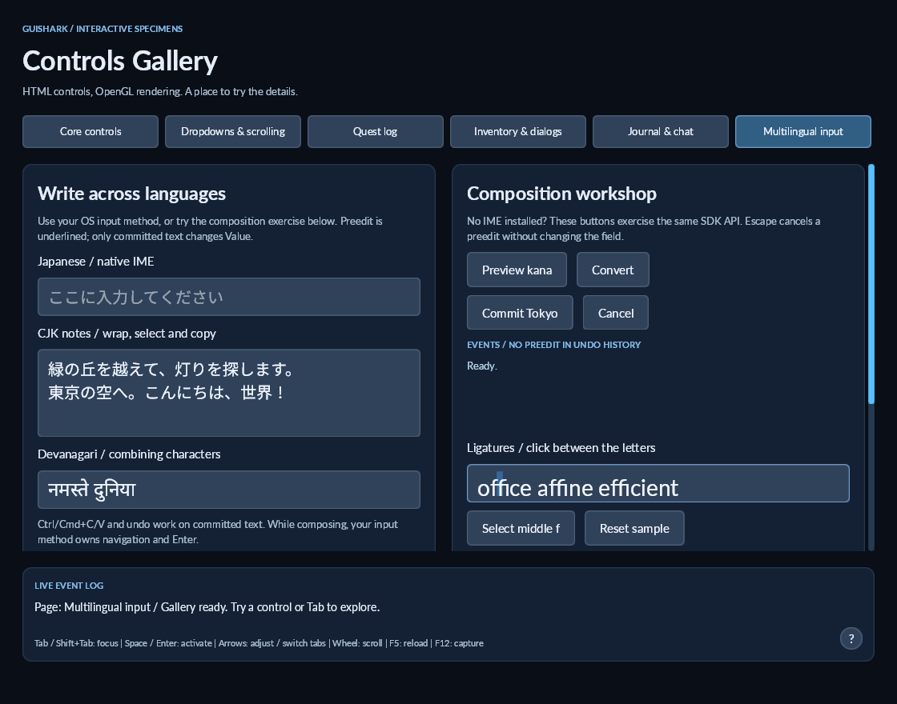

# Shaped text editing

Skia + HarfBuzz now supplies a complete line's grapheme caret coordinates through `ITextMetrics.CreateCaretMap`. The editor uses these coordinates for mouse placement, horizontal and vertical caret geometry, selection rectangles and composition underlines. Each wrapped line is shaped independently, just as it is when drawn.

The implementation reads UTF-16 HarfBuzz clusters and pen advances, not glyph ink offsets. It merges clusters inside the same Unicode grapheme. A ligature covering multiple graphemes receives evenly spaced internal caret stops. This is an approximation: OpenType ligature-caret tables are not read. Combining marks and joined emoji sequences have no internal caret stop; movement and deletion continue to use Unicode graphemes. Deleting one letter in a Latin ligature reshapes the remaining text rather than deleting the entire ligature.

Password geometry shapes bullets and remaps their coordinates to the original UTF-16 boundaries. Clipboard restrictions and undo behavior are unchanged. Coordinates stay in logical UI units when raster density changes; the backend keeps a bounded caret-map cache and clears it when rendering options change.

Existing metrics implementations remain source-compatible: the default interface method measures prefixes. A custom shaping backend should implement `CreateCaretMap` and supply one finite coordinate for each `StringInfo` grapheme boundary, including the end. `TextCaretMap` copies the supplied coordinates and exposes `X(index)` and `Nearest(x)`.

This does not implement bidirectional paragraph layout, RTL visual navigation or color emoji. Local font fallback uses the same run boundaries for drawing and caret geometry. A single RTL run can supply descending coordinates, but complete RTL editing is not claimed.

## Try it

```powershell
dotnet run --project src/demos/GuiShark.ControlsDemo -- --page=multilingual
```

The Multilingual tab includes ligature and combining-mark fields. Click **Select middle f** to highlight part of the `ffi` in `office`. Try dragging, Shift + arrows, Backspace and undo; compare the Devanagari field too. **Reset sample** restores the ligature text and selection.

For a deterministic screenshot:

```powershell
dotnet run --project src/demos/GuiShark.ControlsDemo -- --capture --page=multilingual --select-ligature
```

Regression coverage includes real Skia/HarfBuzz shaping with bundled Lato fonts, contextual mouse/caret geometry, partial ligature selection, preedit, wrapped lines, vertical movement, password offsets, surrogate pairs, combining marks and joined emoji sequences. Tests require the restored native Skia/HarfBuzz libraries, but no window or OpenGL context. Missing emoji glyphs in Lato are intentional in the boundary tests; they are not evidence of emoji rendering support.

## Validation

On Windows x64 with .NET 10.0.401, fresh Debug and Release builds cover all seven projects with zero errors and the unchanged 64 analyzer warnings. All 48 tests pass in each configuration, including twelve new cases. The native OpenGL gallery capture was visually inspected: the middle `f` occupies its own selection area inside the `ffi` ligature. Linux/macOS execution and physical IME candidate placement were not tested in this milestone.


