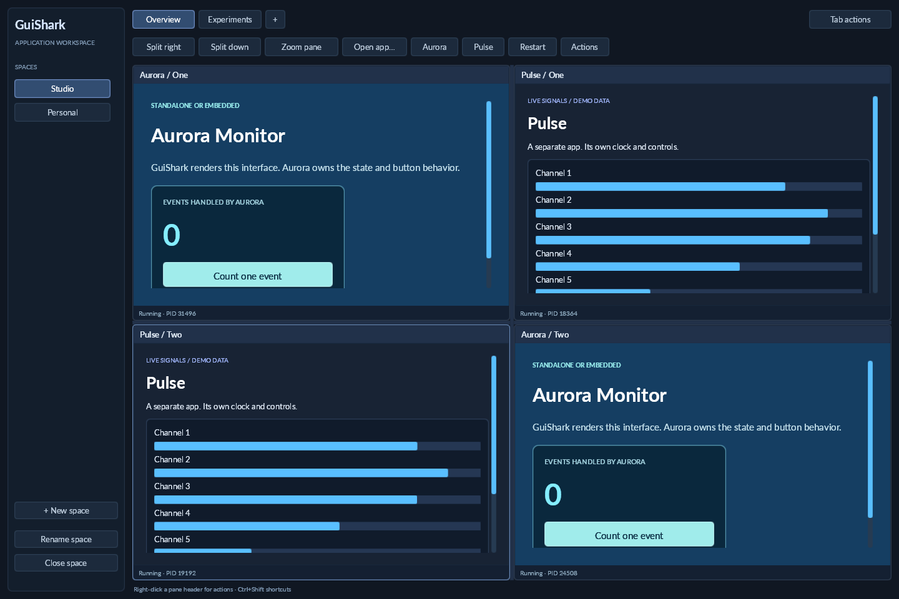

# GuiShark Workspace

A first graphical workspace inspired by [Herdr's spaces, tabs and panes](https://herdr.dev/docs/concepts/). The shell is rendered with GuiShark HTML/CSS; independently built GuiShark applications run in separate processes. It is an optional consumer, not a new responsibility of the HTML/CSS engine.



## Run

From the repository root, on a desktop with .NET 10 and OpenGL 3.3:

```powershell
dotnet build Gui.Shark.sln -c Release
dotnet run --no-build -c Release --project src/demos/GuiShark.Workspace
```

The initial Studio space has an Overview tab with four panes: two Aurora counters and two Pulse signal monitors. Each instance has its own process and state. Experiments and Personal provide empty layouts to arrange more apps. Pulse uses generated demo data, not an external API, and can also run independently:

```powershell
dotnet run --no-build -c Release --project src/demos/GuiShark.PulseProcess
```

## Arrange and use applications

- Click a space in the sidebar or a tab to switch layouts. Existing app processes continue running.
- Click an app or pane header to select its pane. Input inside app content is delivered only to that app. Pane headers belong to the workspace.
- Split right/down adds an empty pane next to the selected pane. Drag the six-pixel divider to change proportions. Closing a pane collapses its split branch.
- Choose Aurora or Pulse in an empty pane or the toolbar. Open app accepts an absolute or repository-relative path to another trusted local `app.json`. Replacing a pane's app stops the previous process.
- Zoom expands the selected pane; Restore panes returns to its split layout.
- Actions, Tab actions, or right-click on a pane header opens rename/close, split, restart, and deliberate freeze/crash actions. Application content does not reserve right-click for a host menu.
- Close actions ask for `close` before stopping the affected apps. Closing the last tab/space leaves a fresh empty layout.
- Failed apps show a recovery panel with Restart. A two-second frame gap after readiness marks an app unresponsive while retaining its last frame. This is a heuristic for this continuously publishing protocol, not a general application health guarantee.
- Small app panes can scroll their own content. More than four tabs use a scrollable tab chooser to keep all tabs reachable; the spaces list scrolls.

Keyboard equivalents use Ctrl+Shift: E split right, D split down, T new tab, N new space, Z zoom/restore, R restart selected app, W close pane, PageUp/PageDown previous/next tab. Escape dismisses workspace menus/prompts; other keyboard input goes to the focused app or shell control. Closing the native window stops its apps.

This prototype caps layouts at 32 spaces, 32 tabs per space, 16 panes per tab, and 16 app processes across the workspace. Resizing clamps split proportions to keep both branches reachable; very deeply split panes can still become small. Zoom is available for such layouts.

## Save and restore

Layout is saved as versioned JSON in the platform's LocalApplicationData/GuiShark/workspace.json directory. It contains names, IDs, active locations, split ratios, zoom, and absolute app manifest paths. It never contains process handles, GL resources, or application state. Use a separate layout file with:

```powershell
dotnet run --no-build -c Release --project src/demos/GuiShark.Workspace -- --state artifacts/my-workspace.json
```

Saving writes a temporary file then replaces the snapshot. Invalid or unsupported snapshots are preserved and a default workspace is displayed without overwriting them. Missing packages appear as a failed pane rather than stopping the host. Restoring a valid layout starts fresh app processes, including those in inactive tabs. Only open layouts/packages you trust: apps execute as the current user.

App counters and clocks survive tab/space switches, but are reset on process restart. There is no daemon or detach/reattach support; apps do not survive workspace exit. Herdr makes the same distinction between [live server persistence and snapshot restoration](https://herdr.dev/docs/session-state/); a background broker is a later milestone.

## Boundaries and ownership

- `src/demos/GuiShark.Workspace` owns the split tree, spaces/tabs/panes, shell commands, focus routing, sessions and layout persistence. Layout leaves carry stable pane IDs; sessions are keyed by those IDs independently of visibility.
- `src/hosting/GuiShark.ProcessHosting` is the optional experimental process launcher, pipe client, app-window runner, frame encoder/display and viewport adapter. Both original ProcessHost and Aurora now consume it; Pulse is a second independent consumer. The host has no project reference to Aurora or Pulse.
- `src/hosting/GuiShark.AppProtocol` defines generic messages. Apps own their own UiView, HTML/CSS, callbacks and rendering contexts. An executable runs standalone without arguments, or embedded with `--pipe <name>`.
- `src/GuiShark` and `src/GuiShark.OpenGL` remain unchanged. The chrome rebuilds its document on structural changes while model/session state is retained; a general dynamic DOM API can improve that later without putting workspace logic in the core.

Each process connection separates reliable lifecycle/control messages from a latest-only frame mailbox. Host input is ordered and bounded; overflow explicitly stops that session instead of silently discarding releases. Focus loss cancels child input capture. Closing/removing/replacing a pane disposes its session and GL display resources; pipe tasks complete cancellation before releasing their cancellation source. The shared runner handles native standalone pointer, wheel, key and committed-text input as well as embedded forwarding.

## Verification and limits

```powershell
dotnet run --no-build -c Release --project src/demos/GuiShark.Workspace -- --verify
dotnet run --no-build -c Release --project src/demos/GuiShark.Workspace -- --capture
```

Both modes use an isolated temporary layout. Verify exercises actual HTML shell controls, then four distinct app PIDs, a routed Aurora button click, an unresponsive child, continued peer/host rendering, fatal child crash and restart, navigation without restarting apps, split collapse, zoom and saved-layout round trip. Capture writes artifacts/workspace.png and closes. No new unit/integration test suite was added in this milestone.

Windows desktop graphics have been checked. Linux/macOS execution remains unverified; source uses portable .NET/OpenTK/Skia APIs and has no Windows-only window embedding. Native display, driver and packaging behavior still require checks on those platforms.

Frames remain PNG/base64 over a local named pipe, paced at approximately 10 FPS per app. This is a workspace UI prototype, not a demonstrated high-frame-rate game/video transport. Hidden tabs continue receiving frames and updating; visibility throttling and performance measurements are future work. IME preedit and system clipboard bridging are not implemented in this host. It is fault isolation, not a sandbox. Split/pane movement between tabs/spaces, drag tab reordering, installation/catalog commands, remote hosting and a persistent background broker are deferred.

## Next milestones

1. Use this shell with a real small application and measure input latency, CPU/memory and resize/DPI behavior with two/four visible panes.
2. Add pane movement and tab reordering while retaining the same process sessions, then improve command discovery and focus navigation.
3. Add native IME/clipboard adapters and visibility-aware rendering. Change frame transport only when measured workloads justify it.
4. Introduce installation/catalog and background reconnectable sessions only when daily use demonstrates a need.

Recorded Windows validation (2026-10-04): all 14 projects are included in Debug/Release; both fresh builds passed with zero errors and the existing 62 warnings. All 86 existing regression tests passed in each configuration. Both workspace desktop verification runs passed, including tab overflow and a recovery-button click across frames; the original process host and standalone Aurora checks passed after extracting the runtime. The Release screenshot above was inspected. Linux/macOS and transport performance benchmarks remain unverified.
